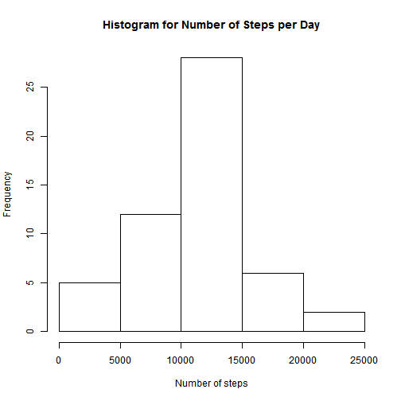
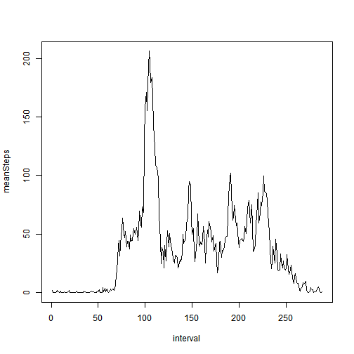
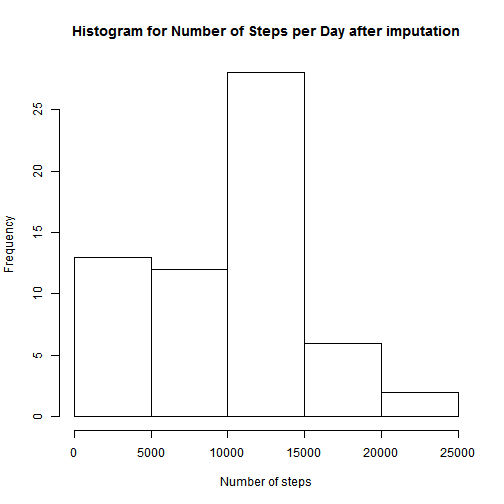
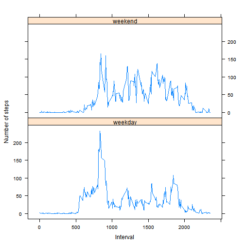

# Reproducible Research: Peer Assessment 1

## Loading and preprocessing the data

> Show any code that is needed to
> 
> 1. Load the data (i.e. `read.csv()`)
> 
> 2. Process/transform the data (if necessary) into a format suitable for your analysis

Read the CSV file and eliminate NA records


```r
dsRaw <- read.csv(file.path(getwd(), "activity.csv"))
good<-complete.cases(dsRaw[,"steps"])
ds<-dsRaw[good,]
```

## What is mean total number of steps taken per day?
> For this part of the assignment, you can ignore the missing values in
> the dataset.
> 
> 1. Make a histogram of the total number of steps taken each day
> 
> 2. Calculate and report the **mean** and **median** total number of steps taken per day

Aggregate the number of steps taken each day.


```r
dsDaily<-aggregate(steps~date,ds,FUN=sum)
```

Plot a histogram of the total number of steps taken each day.


```r
hist(dsDaily$steps,main="Histogram for Number of Steps per Day",,xlab="Number of steps")
```

 

Calculate and report the mean number of steps taken per day


```r
dmean <- mean(dsDaily$steps)
print(paste("the mean number of steps taken per day is : ", as.character(dmean)))
```

```
## [1] "the mean number of steps taken per day is :  10766.1886792453"
```

Calculate and report the median total number of steps taken per day


```r
dmedian <- median(dsDaily$steps)
print(paste("the median total number of steps taken per day is : ", as.character(dmedian)))
```

```
## [1] "the median total number of steps taken per day is :  10765"
```

## What is the average daily activity pattern?

> 1. Make a time series plot (i.e. `type = "l"`) of the 5-minute interval (x-axis) and the average number of steps taken, averaged across all days (y-axis)
> 
> 2. Which 5-minute interval, on average across all the days in the dataset, contains the maximum number of steps?

Aggregate the average number of steps taken by 5-minute interval.


```r
dsInterval<-aggregate(steps~interval,ds,FUN=mean)
```

Plot a time series of the 5-minute interval and the average number of steps taken across all days.


```r
plot(dsInterval$steps, type="l",xlab="interval",ylab="meanSteps")
```

 


```r
print(paste("The interval with the most steps is the interval #", as.character(which.max(dsInterval$steps))))
```

```
## [1] "The interval with the most steps is the interval # 104"
```

## Imputing missing values

> Note that there are a number of days/intervals where there are missing
> values (coded as `NA`). The presence of missing days may introduce
> bias into some calculations or summaries of the data.
> 
> 1. Calculate and report the total number of missing values in the dataset (i.e. the total number of rows with `NA`s)
> 
> 2. Devise a strategy for filling in all of the missing values in the dataset. The strategy does not need to be sophisticated. For example, you could use the mean/median for that day, or the mean for that 5-minute interval, etc.
> 
> 3. Create a new dataset that is equal to the original dataset but with the missing data filled in.
> 
> 4. Make a histogram of the total number of steps taken each day and Calculate and report the **mean** and **median** total number of steps taken per day. Do these values differ from the estimates from the first part of the assignment? What is the impact of imputing missing data on the estimates of the total daily number of steps?

total number of missing values in the dataset


```r
bad<-is.na(dsRaw)
tbad<-table(bad)
print(paste("Total number of missing values in the dataset : ", as.character(tbad[2])))
```

```
## [1] "Total number of missing values in the dataset :  2304"
```

Use the [VIM](http://cran.r-project.org/web/packages/VIM/index.html) package to impute missing values of the dataset.
Use k-Nearest Neighbour Imputation.
The `kNN` function returns a dataset with all `NA`s replaced.


```r
library(VIM)
```

```
## Warning: package 'VIM' was built under R version 3.1.1
```

```
## Loading required package: colorspace
## Loading required package: grid
## VIM is ready to use. 
##  Since version 4.0.0 the GUI is in its own package VIMGUI.
## 
##           Please use the package to use the new (and old) GUI.
## 
## 
## Attaching package: 'VIM'
## 
## The following object is masked from 'package:datasets':
## 
##     sleep
```

```r
dsImputed<-kNN(dsRaw)
```

```
## Time difference of -6.222 secs
```

After imputation of missing values

Aggregate the number of steps taken each day.


```r
dsDailyImputed<-aggregate(steps~date,dsImputed,FUN=sum)
```

Plot a histogram of the total number of steps taken each day after imputation.


```r
hist(dsDailyImputed$steps,main="Histogram for Number of Steps per Day after imputation",xlab="Number of steps")
```

 

Calculate and report the mean number of steps taken per day after imputation


```r
dmeanImputed <- mean(dsDailyImputed$steps)
print(paste("the mean number of steps taken per day after imputation is : ", as.character(dmeanImputed)))
```

```
## [1] "the mean number of steps taken per day after imputation is :  9752.39344262295"
```

Calculate and report the median total number of steps taken per day after imputation


```r
dmedianImputed <- median(dsDailyImputed$steps)
print(paste("the median total number of steps taken per day after imputation is : ", as.character(dmedianImputed)))
```

```
## [1] "the median total number of steps taken per day after imputation is :  10395"
```

## Are there differences in activity patterns between weekdays and weekends?

> For this part the `weekdays()` function may be of some help here. Use
> the dataset with the filled-in missing values for this part.
> 
> 1. Create a new factor variable in the dataset with two levels -- "weekday" and "weekend" indicating whether a given date is a weekday or weekend day.
> 
> 2. Make a panel plot containing a time series plot (i.e. `type = "l"`) of the 5-minute interval (x-axis) and the average number of steps taken, averaged across all weekday days or weekend days (y-axis). The plot should look something like the following, which was creating using **simulated data**:
> 
>  
> 
> **Your plot will look different from the one above** because you will
> be using the activity monitor data. Note that the above plot was made
> using the lattice system but you can make the same version of the plot
> using any plotting system you choose.


Create a new factor variable in the dataset with two levels -- "weekday" and "weekend" indicating whether a given date is a weekday or weekend day.


```r
require(lattice)
```

```
## Loading required package: lattice
```

```r
fn = function(x) {
  day = weekdays(as.Date(x[[2]]))
  if (day == "Saturday" | day == "Sunday") {
    "weekend"
  } else {
    "weekday"
  }
}
day = apply(dsImputed, 1, fn)
dsImputed$day = as.factor(day)
```

Aggregate the average number of steps taken by 5-minute interval.


```r
x = aggregate(steps ~ interval+day, dsImputed, mean)
```

Plot two time series (one for weekdays and the other for weekends) of the 5-minute intervals and average number of steps taken (imputed values).


```r
xyplot(steps~interval|day, data=x, type="l", xlab="Interval", ylab="Number of steps", layout=c(1,2))
```

 
